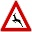

# **Traffic Sign Recognition** 


### The project analyzes the input image of german traffic sign and predicts the label for the image.

---

The goals / steps of this project are the following:
* Load the data set (see below for links to the project data set)
* Explore, summarize and visualize the data set
* Design, train and test a model architecture
* Use the model to make predictions on new images
* Analyze the softmax probabilities of the new images
* Summarize the results with a written report


---
### Writeup

You're reading it! and here is a link to my [project code](https://github.com/nikhil-sinnarkar/CarND-Traffic-Sign-Classifier-Project/blob/master/Traffic_Sign_Classifier.ipynb)

### Data Set Summary & Exploration

#### 1. Here is the basic summary of the data set.

I used the numpy library to calculate summary statistics of the traffic
signs data set:

* The size of training set is 34799
* The size of the validation set is ?
* The size of test set is 12630
* The shape of a traffic sign image is 32x32x3
* The number of unique classes/labels in the data set is 43

#### 2. Exploratory visualization of the dataset.

Here is an exploratory visualization of the data set. It is a bar chart showing training, validation and test data.


### Design and Test a Model Architecture

#### 1. Preprocessing the image data.

Initially I trained my model on the given data set without any preprocessing and got around 86% accuracy. To increase the accuracy, I implemented preprocessing and got the accuracy up to 90%. This wasn't enough so to further increase it I went for data augmentation.

To augment the given training data I used rotation and brightness change. I increased the brightness of the images in training dataset by 20% and added them back to initial training data set.
```python
image = cv2.multiply(image_list[i], np.array([1.2]))
```
Then I ramdomly selected half of the images in training dataset and rotated them and added them to initial training dataset.
```python
rows,cols = image.shape[:2]
M = cv2.getRotationMatrix2D((cols/2,rows/2), 5, 1.2)
image = cv2.warpAffine(image,M,(cols,rows))
```
I converted this augmented training dataset into grayscale followed by normalization.
Here is an example of a traffic sign image before and after preprocessing.


#### 2. Final model architecture.

My final model consisted of the following layers:

| Layer         		|     Description	        					| 
|:---------------------:|:---------------------------------------------:| 
| Input         		| 32x32x1 Grayscale image						| 
| Convolution 3x3     	| 1x1 stride, valid padding, outputs 28x28x6 	|
| RELU					|												|
| Max pooling	      	| 2x2 stride,  outputs 14x14x6	 				|
| Convolution 3x3	    | 1x1 stride, valid padding, outputs 10x10x16	|
| RELU					|												|
| Max pooling	      	| 2x2 stride,  outputs 5x5x16	 				|
| Flatten				| outputs 400  									|
| Fully connected		| outputs 120									|
| RELU					|												|
| Dropout				| 												|
| Fully connected		| outputs 84									|
| RELU					|												|
| Dropout				| 												|
| Fully connected		| outputs 43									|
| Softmax				| 												|


#### 3. Training the model.

To train the model, I used Adam Optimizer with learning rate = 0.001

I kept the batch size as 128 and changed the number of epochs to 25.

#### 4. Getting the desired validation accuracy (i.e. > 0.93). 

I used the LeNet architecture for my CNN. First I ran the model as is and got the validation accuracy of 0.86, without any preprocrssing of training data. Next I normalized the images which increased the validation accuracy
to around 0.90.
I further increased the accuracy by doing data augmentation also I used dropout layer in between the fully connected layers in the LeNet architecture.

The final values of the parameters I used -
* No. of epochs = 25
* Batch size = 128
* Learning rate = 0.001
* Keep prob for dropout = 0.7

My final model results were:
* training set accuracy of ?
* validation set accuracy of ? 
* test set accuracy of ?
 

### Test the Model on New Images

Here are seven German traffic signs that I found on the web:

	-	Stop
	-	Speed limit (70km/h)
	-	Roundabout mandatory
	-	No entry
	-	Turn left ahead
	-	Wild animals crossing
	-	Right-of-way at the next intersection

Some of the image might be difficult to classify. For eg. The second image as there is very little difference form other speed limit signs. The fourth image of "No Entry" is similar to "No passing" because in no passing the 2 cars form a kind of horizontal line.

#### 2. Discuss the model's predictions on these new traffic signs and compare the results to predicting on the test set. At a minimum, discuss what the predictions were, the accuracy on these new predictions, and compare the accuracy to the accuracy on the test set (OPTIONAL: Discuss the results in more detail as described in the "Stand Out Suggestions" part of the rubric).

Here are the results of the prediction:

| Image			        				|     Prediction	        			| 
|:-------------------------------------:|:-------------------------------------:| 
| Stop sign      						| Stop sign   							| 
| 70 km/h     							| 70 km/h 								|
| Roundabout mandatory					| Roundabout mandatory					|
| No entry	      						| No passing					 		|
| Turn left ahead						| Turn left ahead      					|
| Wild animals crossing 				| Wild animals crossing					|
| Right-of-way at the next intersection	| Right-of-way at the next intersection	|


The model was able to correctly guess 6 of the 7 traffic signs, which gives an accuracy of 85.7%.

#### 3. Softmax probabilities for each prediction.

For the first image, the model is relatively sure that this is a stop sign (probability of 0.6), and the image does contain a stop sign. The top 5 soft max probabilities were

| Probability         		|     Prediction	        					| 
|:-------------------------:|:---------------------------------------------:| 
| 1.0         				| Stop sign   									| 
| 1.5827489569293385e-16	| Speed limit (30km/h)							|
| 6.244197185238654e-17		| Speed limit (50km/h)							|
| 2.601082836498919e-17		| Speed limit (60km/h)			 				|
| 6.200373714732508e-19    	| Yield			      							|


For the second image ...

| Probability         		|     Prediction	        					| 
|:-------------------------:|:---------------------------------------------:| 
| 0.9257188439369202		| Speed limit (70km/h)   						| 
| 0.03445085883140564		| Speed limit (50km/h)							|
| 0.03213305398821831		| Speed limit (30km/h)							|
| 0.007658441085368395		| Speed limit (80km/h)			 				|
| 3.2226515031652525e-05   	| Speed limit (20km/h) 							| 

For the third image ...

| Probability         		|     Prediction	        					| 
|:-------------------------:|:---------------------------------------------:| 
| 0.8391516208648682		| Roundabout mandatory   						| 
| 0.07796236872673035		| Traffic signals								|
| 0.07510343194007874		| Bicycles crossing								|
| 0.004488117527216673		| Children crossing				 				|
| 0.0014104560250416398   	| Priority road 								| 

For the fourth image ...

| Probability         		|     Prediction	        					| 
|:-------------------------:|:---------------------------------------------:| 
| 0.936417818069458			| No passing			   						| 
| 0.06358210742473602		| No Entry										|
| 8.132214901479529e-09		| Vehicles over 3.5 metric tons prohibited		|
| 1.6441529249178188e-09	| Ahead only					 				|
| 7.352458225584613e-11   	| Priority road 								| 

For the fifth image ...

| Probability         		|     Prediction	        					| 
|:-------------------------:|:---------------------------------------------:| 
| 1.0						| Turn left Ahead  		 						| 
| 2.827686745349735e-23		| Ahead only									|
| 2.4810596834086216e-26	| Keep right									|
| 1.8563093812814658e-32	| Speed limit (60km/h)			 				|
| 0.0					   	| Speed limit (20km/h) 							| 

For the sixth image ...

| Probability         		|     Prediction	        					| 
|:-------------------------:|:---------------------------------------------:| 
| 1.0						| Wild animals crossing   						| 
| 1.0015952843045288e-16	| Double curve									|
| 1.8813556350390394e-22	| Dangerous curve to the left					|
| 1.0560101385549895e-28	| Road work						 				|
| 6.832963612805199e-34   	| No passing for vehicles over 3.5 metric tons	| 

For the seventh image ...

| Probability         		|     Prediction	        					| 
|:-------------------------:|:---------------------------------------------:| 
| 1.0						| Right-of-way at the next intersection   		| 
| 4.868115643455838e-29		| Beware of ice/snow							|
| 0.0						| Speed limit (20km/h)							|
| 0.0						| Speed limit (30km/h)				 			|
| 0.0   					| Speed limit (50km/h) 							| 

